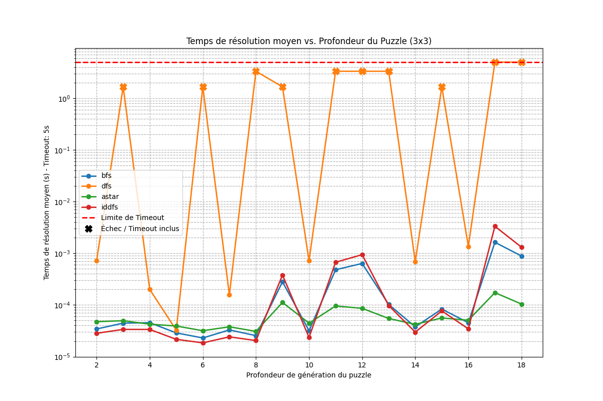

# Projet de Planification en Intelligence Artificielle

Ce projet met en œuvre et compare différentes approches de planification et de recherche en intelligence artificielle, appliquées à des problèmes classiques comme le Taquin, les Tours de Hanoï et le Sokoban.

### 0. Prérequis

Installer Java 21
```bash
sudo apt install openjdk-21-jre-headless 
```

Installer Maven : 
```bash
sudo apt install maven
```

### 1. Recherche dans un Espace d'États : Le Taquin

Cette section concerne la résolution du jeu du Taquin à l'aide de plusieurs algorithmes de recherche.

#### Algorithmes implémentés
*   Recherche en largeur d'abord (Breadth-First Search)
*   Recherche en profondeur d'abord (Depth-First Search)
*   Recherche Best-First avec l'heuristique A* (A* Search)
*   Recherche en profondeur itérative (Iterative Deepening Depth-First Search)

#### Générateur de Taquins
Un générateur de problèmes a été développé pour créer des grilles de taquin de difficulté croissante (basée sur la taille et le nombre de mélanges).

```bash
# Pour utiliser le générateur, exécutez la commande suivante :
python3 generate_npuzzle.py -s [taille du puzzle] -ml [longueur max de résolution] -n [nombre de puzzles] -v [verbosité] [répertoire de sortie (le répertoire doit exister au préalable)]
```

#### Encodage
L'état du taquin est encodé de la manière suivante :
Sous la forme d'une liste d'entiers unidimensionnelle (de type `List[int]`). Cette liste représente la grille du taquin aplatie **ligne par ligne**, lue de gauche à droite puis de haut en bas.
*   **Valeurs :** Les entiers dans la liste représentent les numéros inscrits sur les tuiles.
*   **Case vide :** Elle est toujours représentée par la valeur `0`.
*   **Taille :** La longueur de la liste correspond au carré de la dimension de la grille (ex: 9 éléments pour un taquin 3x3, ou 16 pour un 4x4).
*   **Exemple :** L'état but (résolu) d'un taquin 3x3 est stocké sous la forme `[0, 1, 2, 3, 4, 5, 6, 7, 8]`. Cela correspond à une grille où la case vide (`0`) se trouve dans le coin supérieur gauche, suivie de `1` et `2` sur la première ligne, puis `3, 4, 5` sur la deuxième, etc.

#### Solveur de Taquins
Un script a été développé pour résoudre les instances générées avec les différents algorithmes de recherche :
```bash
# Pour utiliser le solveur, exécutez la commande suivante :
python3 solve_npuzzle.py [chemin/vers/fichier.txt] -a {bfs,dfs,astar,iddfs} [-v] [-d PROFONDEUR_MAX]
```

#### Analyse des Performances
Le graphique ci-dessous illustre les performances relatives de chaque méthode de recherche.
*   **Abscisse :** Problèmes de taquins, triés du plus simple au plus difficile selon la profondeur de génération.
*   **Ordonnée :** Temps de résolution pour chaque méthode.



### 2. Langage PDDL

Modélisation de problèmes classiques avec le langage PDDL (Planning Domain Definition Language).

Un script de lancement automatique est fourni pour résoudre les problèmes pddl : 
```bash
./pddlj4_auto.sh 1 <domain.pddl> <problem.pddl> <timeout_sec> <heuristic_id>
```

#### Tours de Hanoï
*   **Description :** Problème des Tours de Hanoï avec 3 disques et 3 piquets.
*   **Fichier Domaine :** `pddl/hanoi_tower/domain.pddl`
*   **Fichiers Problèmes :**
*   **`p002.pddl` (2 disques, 3 tours) :** Instance très simple pour tester rapidement la validité du domaine. L'objectif est de déplacer 2 disques (`a`, `b`) de la tour `t1` à la tour `t3`.
*   **`p003.pddl` (3 disques, 3 tours) :** Instance classique correspondant au problème de base du projet. L'objectif est de déplacer 3 disques (`a`, `b`, `c`) de la tour `t1` vers la tour `t3`.
*   **`p001.pddl` (4 disques, 4 tours) :** Instance plus vaste introduisant un 4ème disque (`d`) et une 4ème tour (`t4`). L'objectif est de déplacer la tour complète de `t1` vers `t4`.


#### Taquin
*   **Description :** Modélisation classique du jeu du Taquin où des tuiles numérotées doivent glisser vers la case vide pour atteindre l'état ordonné.
*   **Fichier Domaine :** `pddl/taquin/domain.pddl`
*   **Fichiers Problèmes :**
    *   **`p001.pddl` (Grille 2x2, 3 tuiles) :** Instance d'introduction très petite (4 cases, 3 tuiles). Idéale pour vérifier très rapidement la modélisation des déplacements.
    *   **`p002.pddl` (Grille 3x3, 8 tuiles) :** Le problème classique du Taquin (8-puzzle). Grille de 9 cases avec 8 tuiles à ordonner.
    *   **`p003.pddl` (Grille 4x4, 15 tuiles) :** Instance plus grande et plus complexe (15-puzzle). Grille de 16 cases demandant beaucoup plus de temps de recherche pour être résolue.

#### Sokoban
*   **Description :** Modélisation classique du jeu Sokoban où un gardien doit pousser des caisses sur des cibles.
*   **Fichiers Problèmes :**
    *   **`p001.pddl` (1 caisse) :** Instance d'introduction très simple (7 cases, 1 gardien, 1 caisse). Idéale pour vérifier rapidement la validité des actions de base (se déplacer, pousser).
    *   **`p003.pddl` (3 caisses) :** Niveau intermédiaire ("niveau_2"). Grille comportant 1 gardien et 3 caisses à amener sur leurs cibles.
    *   **`p002.pddl` (4 caisses) :** Niveau plus complexe et vaste issu d'une capture d'écran ("sokoban-level-screenshot"). La topologie inclut des murs (cases non connectées) et requiert de placer 4 caisses.

#### Poursuite Évasion
*   **Description :** Problème de parcours de graphe où des policiers doivent "nettoyer" des arêtes (liens) en les visitant sans permettre de recontamination. La gestion des arêtes à visiter se fait via un système de piles, demandant aux policiers de se coordonner, de se grouper ou de laisser des gardes.
*   **Fichier Domaine :** `pddl/poursuite_evasion/domain.pddl`
*   **Fichiers Problèmes :**
    *   **`p001.pddl` (1 policier, 3 cases) :** Graphe linéaire simple (`c1-c2-c3`). Un seul policier démarre en `c1` et doit parcourir le graphe pour vider les piles d'arêtes.
    *   **`p002.pddl` (2 policiers, 3 cases) :** Même topologie linéaire que `p001`, mais introduit deux policiers placés aux deux extrémités (`c1` et `c3`). Parfait pour tester la coordination et les regroupements.
    *   **`p003.pddl` (3 policiers, 4 cases) :** Topologie en étoile avec un nœud central (`c2`) connecté à trois impasses (`c1`, `c3`, `c4`). Trois policiers démarrent dans les impasses et doivent nettoyer toutes les arêtes en convergeant.
    *   **`p004.pddl` (2 policiers, 4 cases) :** Topologie en étoile identique à `p003`. Deux policiers démarrent dans deux des impasses (`c1` et `c3`).
    *   **`p005.pddl` (2 policiers, 4 cases) :** Même topologie en étoile. Les deux policiers démarrent sur la même case (`c1`) et sont déjà groupés (`with-company`).
    *   **`p006.pddl` (2 policiers, 5 cases) :** Graphe plus complexe introduisant un cycle (`c2-c4-c5`). Deux policiers démarrent sur la même case (`c1`) mais en tant qu'individus séparés (`single-cop`), forçant le planificateur à utiliser l'action de regroupement.

### 3. Sokoban

Une application web pour le jeu du Sokoban, intégrant un planificateur PDDL.

#### Architecture de l'application
*   **Parser JSON :** Un parser a été implémenté pour lire les fichiers de configuration des niveaux de Sokoban.
*   **Planificateur :** L'application intègre un planificateur basé sur le code Java fourni. Elle utilise le domaine PDDL `sokoban-domain.pddl` et des scripts pour invoquer les planificateurs de PDDL4J.

#### Lancement de l'application
Pour lancer l'application web depuis la VM PATIA, suivez ces étapes :
```bash
# 1. Installer la dépendance vers PDDL4J : 
cd Sokoban
mvn install:install-file -Dfile=./pddl4j-4.0.0.jar -DgroupId=fr.uga -DartifactId=pddl4j -Dversion=4.0.0 -Dpackaging=jar -DgeneratePom=true -Djava.net.useSystemProxies=true

# 2. Compiler le projet
mvn compile

# 3. Lancer le serveur (choisir un fichier de test dans le dossier Sokoban/config)
java --add-opens java.base/java.lang=ALL-UNNAMED -server -Xms2048m -Xmx2048m -cp "$(mvn dependency:build-classpath -Dmdep.outputFile=/dev/stdout -Djava.net.useSystemProxies=true -q):target/test-classes/:target/classes" sokoban.SokobanMain CHEMIN_VERS_UN_TEST.json
```
L'application sera ensuite accessible à l'adresse `http://[IP_VM]:4200`.

### 4. SATPlanner

Implémentation d'un planificateur basé sur la satisfiabilité booléenne (SAT).

#### Description de l'implémentation
Mon approche pour implémenter le SATPlanner a été la suivante :
`[Décrivez ici votre implémentation, en expliquant comment vous avez traduit le problème de planification en une formule SAT, en faisant le lien avec les concepts vus en cours.]`

#### Preuve de fonctionnement
Pour prouver le bon fonctionnement du SATPlanner, il peut être testé sur les domaines du Taquin ou du Sokoban. Voici un exemple de son exécution sur un problème simple :
```bash
# Commande pour lancer le SATPlanner sur un problème de test
./yetanothersatplanner.sh 
# Sortie attendue (plan trouvé)
# [Exemple de sortie ici]
```
